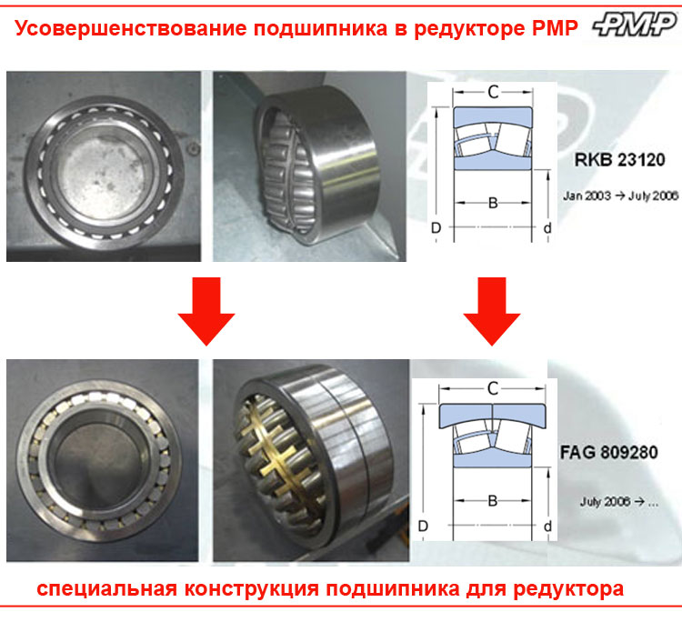

# 6. Отказы и диагностика

Диагностика, дефекты и модели отказов.

## Подразделы
- [6.1. Модель отказов: симптом, причина, действие](<6.1. Модель отказов симптом, причина, действие/README.md>)
- [6.2. Дефекты дорожек качения](<6.2. Дефекты дорожек качения/README.md>)
- [6.3. Смазка и загрязнения: дефекты](<6.3. Смазка и загрязнения дефекты/README.md>)
- [6.4. Коррозия и фреттинг](<6.4. Коррозия и фреттинг/README.md>)
- [6.5. Электроэрозия: частотники](<6.5. Электроэрозия частотники/README.md>)
- [6.6. Электродвигатели: типовые отказы](<6.6. Электродвигатели типовые отказы/README.md>)
- [6.7. Протокол диагностики: шаблоны](<6.7. Протокол диагностики шаблоны/README.md>)

## Данные для БД
- [data](../data/README.md)
