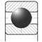

# Подшипники. Общая информация

*Дата последнего обновления: 2026-01-10*

---

## 1.1. Что такое подшипник? Основные функции

### Определение и назначение

**Подшипник** — это механический узел, предназначенный для поддержки вращающихся или качающихся деталей (валов, осей) и восприятия нагрузок от них на корпус машины или конструкции. Это одна из наиболее важных деталей в механике, без которой невозможна работа большинства современных машин и механизмов.

**Историческая справка:**  
Принцип качения для облегчения перемещения грузов использовался еще в древности. Египтяне применяли бревна-ролики для транспортировки огромных блоков при строительстве пирамид. Первые конструкции подшипников были запатентованы в XVIII веке, положив начало современному подшипникостроению.

### Основные функции подшипников

1. **Обеспечение свободного вращения**  
   Подшипники позволяют валу свободно вращаться с минимальным сопротивлением, снижая трение между подвижными и неподвижными частями механизма.

2. **Точное позиционирование**  
   Фиксирование точного положения вала в пространстве относительно корпуса, что критично для работы прецизионных механизмов.

3. **Восприятие нагрузок**  
   Передача и распределение радиальных (перпендикулярных оси вращения) и осевых (вдоль оси) нагрузок от вала на корпус.

4. **Снижение износа**  
   Защита сопряженных деталей от преждевременного износа за счет правильного распределения нагрузок.

5. **Энергоэффективность**  
   Минимизация потерь энергии на трение, что особенно важно в высокоскоростных и энергоемких применениях.

### Принцип работы

Подшипники качения работают на основе **замены трения скольжения трением качения**. При трении качения коэффициент трения в 10-100 раз меньше, чем при трении скольжения, что существенно снижает:
- Энергопотребление
- Тепловыделение
- Износ деталей
- Шум и вибрацию

**Физическая суть:**  
Между внутренним и наружным кольцами расположены тела качения (шарики или ролики), которые катятся по специально обработанным дорожкам качения. Это обеспечивает плавное вращение с минимальным сопротивлением.

### Области применения

Подшипники используются практически во всех отраслях промышленности и техники:
- **Автомобилестроение**: ступицы колес, коробки передач, двигатели
- **Станкостроение**: шпиндели, направляющие, приводы
- **Энергетика**: турбины, генераторы, насосы
- **Бытовая техника**: стиральные машины, вентиляторы, электродвигатели
- **Авиация и космонавтика**: двигатели, системы управления
- **Медицинское оборудование**: прецизионные приборы, томографы

### Сравнение подшипников качения и скольжения

| Характеристика | Подшипники качения | Подшипники скольжения |
|---|---|---|
| Коэффициент трения | 0,001-0,005 | 0,01-0,10 |
| Момент пуска | Низкий | Высокий (требуется преодоление трения покоя) |
| Габариты | Больше в радиальном направлении | Компактнее |
| Смазка | Минимальная | Требуется обильная и постоянная |
| Шум при работе | Умеренный | Низкий |
| Срок службы | Ограничен усталостью материала | Определяется износом |
| Стоимость | Средняя | Низкая |
| Чувствительность к ударам | Высокая | Низкая |

**Ссылки на дополнительные материалы:**
- [Подшипники. Основные термины и определения](../Практические_руководства/Подшипники_Основные_термины_и_определения.md)
- [Из чего состоит подшипник](../Практические_руководства/Из_чего_состоит_подшипник.md)
- [Модуль 1: Фундаментальные основы](../Учебник_Академический/Модуль_1_Фундаментальные_основы.md)
- [Классификация подшипников](../Практические_руководства/Классификация_подшипников.md)

---

## 1.2. Из чего состоит подшипник

### Основные конструктивные элементы

Шариковый подшипник качения состоит из следующих основных деталей:

#### 1. Внутреннее кольцо (внутренняя обойма)

**Назначение:** Плотно насаживается на вал и вращается вместе с ним.

**Конструктивные особенности:**
- Имеет желобчатую дорожку качения на наружной поверхности
- Изготавливается с посадочным отверстием (цилиндрическим или коническим)
- На торцах выполнены фаски для облегчения монтажа
- Размеры строго нормированы по ГОСТ

#### 2. Наружное кольцо (наружная обойма)

**Назначение:** Неподвижно закрепляется в корпусе механизма.

**Конструктивные особенности:**
- Имеет желобчатую дорожку качения на внутренней поверхности
- Наружная поверхность — посадочная для установки в корпус
- Может иметь стопорные канавки для фиксации
- В некоторых конструкциях отсутствует (подшипники без наружного кольца)

#### 3. Тела качения

**Назначение:** Катятся по дорожкам качения колец, обеспечивая свободное вращение с минимальным трением.

**Типы тел качения:**

| Тип | Форма | Применение | Особенности |
|---|---|---|---|
| **Шарики** | Сферическая | Радиальные и радиально-упорные подшипники | Точечный контакт, низкое трение, универсальность |
| **Цилиндрические ролики** | Цилиндр | Радиальные нагрузки | Линейный контакт, высокая грузоподъемность |
| **Конические ролики** | Усеченный конус | Комбинированные нагрузки | Воспринимают радиальные и осевые нагрузки одновременно |
| **Сферические ролики** | Бочкообразные | Самоустанавливающиеся подшипники | Компенсируют перекосы, высокая грузоподъемность |
| **Игольчатые ролики** | Тонкий длинный цилиндр | Компактные узлы | Малые габариты при высокой нагрузке |

#### 4. Сепаратор (обойма)

**Назначение:** Удерживает тела качения на определенном расстоянии друг от друга, обеспечивая равномерное распределение нагрузки.

**Функции сепаратора:**
- Предотвращает соприкосновение тел качения между собой
- Равномерно распределяет тела качения по окружности
- Удерживает тела качения в неразборных подшипниках
- Направляет тела качения в ненагруженную зону

**Типы сепараторов по материалу:**

| Материал | Обозначение | Преимущества | Недостатки | Применение |
|---|---|---|---|---|
| **Сталь** | Не обозначается | Высокая прочность, малая масса, невысокая стоимость | Требует качественной смазки | Стандартное исполнение для большинства подшипников |
| **Латунь** | Л, Л1 | Хорошая обрабатываемость, низкий коэффициент трения | Ограничение по температуре (до 300°C) | Высокоскоростные и прецизионные подшипники |
| **Бронза** | Б, Б1 | Износостойкость, антифрикционные свойства | Высокая стоимость | Тяжелонагруженные применения |
| **Полиамид** | Е5 | Легкий вес, низкое трение, работа без смазки | Ограничение по температуре (до 120°C) | Малошумные подшипники, пищевая промышленность |
| **Текстолит** | Е, Е1 | Низкий коэффициент трения, вибростойкость | Ограниченная рабочая температура (до 110°C) | Прецизионные высокоскоростные подшипники |

**Конструкции сепараторов:**
- **Штампованные** — из листовой стали, две половины соединяются заклепками
- **Массивные** — механически обработанные из цельного материала
- **Литые** — полимерные, изготавливаются литьем под давлением

#### 5. Уплотнения и защитные шайбы

**Назначение:** Защищают подшипник от загрязнений и удерживают смазку внутри.

**Типы:**
- **Защитные шайбы (Z)** — металлические, без контакта с кольцом, зазорное уплотнение
- **Контактные уплотнения (RS, 2RS)** — резиновые, с контактом, герметичные
- **Бесконтактные уплотнения** — резиновые, с минимальным зазором

### Основные геометрические параметры

**Эскиз подшипника:**

Основные размеры подшипника обозначаются следующим образом:
- **d** — внутренний диаметр подшипника (диаметр отверстия для вала)
- **D** — наружный диаметр подшипника (посадочный диаметр в корпусе)
- **B** — ширина подшипника (для радиальных)
- **T, H** — высота подшипника (для упорных)
- **r** — радиус закругления (фаски) на кольцах

### Материалы изготовления

#### Кольца и тела качения

**Основной материал:** Высокоуглеродистая хромистая сталь ШХ15 (ГОСТ 801-78)

**Химический состав:**
- Углерод: 0,95-1,15%
- Хром: 1,30-1,65%
- Марганец: 0,20-0,40%
- Кремний: 0,17-0,37%

**Характеристики подшипниковой стали:**
- Твердость после термообработки: 60-66 HRC
- Высокая контактная усталостная прочность
- Глубокая прокаливаемость благодаря хрому
- Высокая износостойкость
- Размерная стабильность

**Специальные стали:**
- **ШХ15СГ** — для крупных подшипников
- **ШХ20СГ** — для особо крупных подшипников
- **ШХ4** — для малых подшипников
- **95Х18** — коррозионностойкая (нержавеющая)
- **Керамика** — для гибридных подшипников (экстремальные условия)

#### Сепараторы

- **Штампованная сталь** — стандартный вариант
- **Латунь Л63, ЛС59-1** — для массивных сепараторов
- **Полиамид PA66** — стеклонаполненный
- **Текстолит** — армированный тканью

#### Уплотнения

- **NBR (нитрильный каучук)** — стандартный материал, температура -30...+100°C
- **FKM (фторкаучук)** — высокотемпературный, до +200°C
- **PTFE (фторопласт)** — химически стойкий

### Маркировка подшипников

На кольцах подшипника обязательно наносится маркировка:
- Условное обозначение подшипника (например, 6205)
- Товарный знак или код завода-изготовителя
- Знак года выпуска (буква или символ)
- Класс точности (если выше 0)

**Ссылки на дополнительные материалы:**
- [Из чего состоит подшипник](../Практические_руководства/Из_чего_состоит_подшипник.md)
- [Терминология конструкции подшипников](../Практические_руководства/Терминология_конструкции_подшипников.md)
- [Сепараторы подшипников качения](../Практические_руководства/Сепараторы_подшипников_качения.md)
- [Маркировка подшипников](../Практические_руководства/Маркировка_подшипников.md)

---

## 1.3. Как делают подшипники

### Введение в производство подшипников

С момента, когда человеку стало необходимо перемещать тяжелые предметы, он начал использовать круглые ролики для облегчения работы. Египтяне применяли бревна для транспортировки огромных блоков при строительстве пирамид. В XVIII веке была запатентована первая конструкция подшипников, положившая начало современному подшипникостроению.

Сегодня существуют тысячи размеров, видов и форм подшипников качения: шариковые, роликовые, конические роликовые и игольчатые — это основные типы. Размеры варьируются от миниатюрных для часовых механизмов (диаметр от 1 мм) до гигантских для тяжелой промышленности (диаметр свыше 5 метров, требующих кранов для установки).

### Требования к материалам

Одна из основных характеристик подшипников — **износостойкость**. Для достижения высоких показателей прочности используется **подшипниковая сталь** по ГОСТ 801-78.

**Требования к материалам колец и тел качения:**
- Жесткость
- Прочность
- Высокая контактная усталостная прочность при качении
- Износоустойчивость
- Размерная стабильность
- Хорошая прокаливаемость (глубина закалки)

**Требования к материалам сепараторов:**
- Износоустойчивость
- Достаточная прочность
- Размерная стабильность
- Низкий коэффициент трения

### Сроки изготовления компонентов

Длительность производственного процесса зависит от сложности конструкции подшипника:

| Компонент | Срок изготовления | Примечание |
|---|---|---|
| **Наружное кольцо** | 7-30 дней | Зависит от размера и сложности |
| **Внутреннее кольцо** | 7-30 дней | Зависит от размера и сложности |
| **Тела качения (шарики)** | 10-25 дней | Зависит от степени точности |
| **Сепаратор полимерный** | До 5 дней | Литье под давлением |
| **Сепаратор штампованный** | До 5 дней | Штамповка и сборка |
| **Сепаратор механически обработанный** | До 5 дней | Точение, фрезерование |

**Общий производственный цикл:** От 1 недели до 1 месяца в зависимости от сложности заказа.

### Основные этапы производства подшипников

#### Этап 1. Подготовка сырья и входной контроль

**Процесс:**
- Приемка стали партиями в виде мотков, прутков, труб или полос
- Проверка соответствия требованиям ГОСТ 801-78
- Контроль химического состава
- Проверка макроструктуры и прокаливаемости
- Контроль размеров и кривизны заготовок

**Требования:**
- Все заготовки в партии должны быть одного размера
- Одинаковая температура плавления
- Метод получения стали одной партии должен быть идентичен

#### Этап 2. Механическая обработка колец

**Процесс изготовления колец:**

1. **Нарезка заготовок**
   - Из стальных труб нарезаются кольца-заготовки
   - Размеры выполняются с припуском на термообработку (материал деформируется при закалке)

2. **Формовка**
   - Придание кольцам нужной формы и толщины
   - Токарная обработка для формирования профиля
   - Внутреннее кольцо временно вставляется во внешнее для совместной обработки

3. **Первичная шлифовка**
   - Деталь передается на шлифовальный станок
   - Стачивание припуска
   - Заготовка приобретает нужную ширину
   - Непрерывная подача охлаждающей жидкости

4. **Контроль ширины**
   - Автоматический или ручной контроль размеров
   - Отбраковка несоответствующих деталей

5. **Разделение колец**
   - Разделение внутреннего и внешнего колец
   - Подготовка к автономной обработке каждого кольца

6. **Обработка наружного кольца**
   - Шлифование наружной поверхности до идеальной гладкости
   - Формирование дорожки качения на внутренней поверхности
   - Калибровочный контроль размеров
   - Непрерывное охлаждение специальным маслом

7. **Обработка внутреннего кольца**
   - Шлифование внутреннего отверстия
   - Формирование дорожки качения на наружной поверхности
   - Обработка под постоянным охлаждением
   - Контроль размеров

#### Этап 3. Термическая обработка колец

**Процесс закалки и отпуска:**

1. **Нагрев и закалка**
   - Кольца помещаются в печь при температуре **840-860°C**
   - Выдержка 2-4 часа для равномерного прогрева
   - Охлаждение в масляной ванне (температура масла 60-80°C)
   - Результат: твердость поверхности **60-66 HRC**

2. **Отпуск**
   - Повторный нагрев до **150-170°C**
   - Выдержка 2-3 часа
   - Охлаждение на воздухе
   - Цель: снятие внутренних напряжений, повышение вязкости

**Результат термообработки:** Кольца становятся твердыми, прочными, но сохраняют необходимую вязкость для работы под нагрузкой.

#### Этап 4. Финишная обработка колец

После термообработки кольца имеют высокую твердость, что требует специальных методов обработки:

1. **Финишное шлифование**
   - Обработка шлифовальными кругами (алмазными или из электрокорунда)
   - Достижение очень гладкой и точной поверхности дорожек качения
   - Класс шероховатости: Ra 0,1-0,2 мкм

2. **Суперфиниширование**
   - Доводка дорожек качения специальными абразивными брусками
   - Получение зеркальной поверхности
   - Класс шероховатости: Ra 0,02-0,05 мкм

3. **Полировка**
   - Полировка торцев и наружных поверхностей
   - Придание блеска

4. **Промывка**
   - Удаление масла, абразивных частиц, стружки
   - Использование технических растворителей
   - Сушка сжатым воздухом

#### Этап 5. Изготовление тел качения (шариков)

**Процесс производства шариков:**

1. **Холодная высадка**
   - Проволока заданного диаметра подается в автомат
   - Нарезка на мелкие кусочки
   - Сдавливание с двух сторон под прессом
   - Получение заготовки с "орбитой" (кольцом вокруг экватора)

2. **Удаление орбиты**
   - Шарики подаются в пазы между двумя дисками
   - Один диск вращается, другой неподвижен
   - Орбита стирается, остается припуск ~0,02 мм

3. **Термообработка шариков**
   - Нагрев до 840-860°C
   - Закалка в масле
   - Отпуск при 150-170°C
   - Твердость: 60-66 HRC

4. **Шлифование**
   - Обработка между абразивными дисками
   - Точность: ±0,0001 мм (0,1 мкм)
   - Непрерывное охлаждение

5. **Полировка**
   - Полировка в течение 8-10 часов
   - Получение зеркальной поверхности
   - Класс шероховатости: Ra 0,01-0,02 мкм

6. **Очистка и контроль**
   - Промывка в растворителе
   - Сушка
   - Проверка размеров и качества поверхности
   - Сортировка по классам точности

#### Этап 6. Изготовление сепараторов

**Штампованные стальные сепараторы:**
1. Вырезка заготовок из листовой стали
2. Пробивка отверстий для тел качения
3. Формовка (придание формы)
4. Сверловка отверстий для заклепок
5. Шлифовка острых кромок
6. Термообработка (при необходимости)

**Массивные латунные/бронзовые сепараторы:**
1. Отливка или ковка заготовки
2. Токарная обработка
3. Фрезерование окон для тел качения
4. Шлифовка
5. Полировка

**Полимерные сепараторы:**
1. Литье под давлением
2. Охлаждение в форме
3. Извлечение из формы
4. Контроль размеров

**Текстолитовые сепараторы:**
1. Механическая обработка из заготовки
2. Точение, фрезерование
3. Полировка

#### Этап 7. Сборка подшипника

**Процесс сборки:**

1. **Соединение колец и тел качения**
   - Внутреннее и наружное кольцо устанавливаются соосно
   - Тела качения подаются автоматом в требуемом количестве
   - Равномерное распределение по окружности
   - Скорость подачи контролируется

2. **Установка сепаратора**
   - Для штампованных: установка первой половины, затем второй
   - Заклепывание или защелкивание половин
   - Для полимерных: защелкивание целого сепаратора
   - Для массивных: заведение в собранный подшипник

3. **Проверка вращения**
   - Подшипник вращается на контрольном стенде
   - Проверка легкости вращения
   - Отсутствие заеданий

4. **Установка уплотнений** (при необходимости)
   - Запрессовка защитных шайб или уплотнений
   - Для герметичных подшипников: заполнение смазкой перед установкой второго уплотнения

#### Этап 8. Контроль качества

**Виды контроля:**

1. **Геометрический контроль**
   - Измерение внутреннего и наружного диаметров
   - Проверка ширины
   - Контроль радиального и осевого биения
   - Измерение зазоров

2. **Контроль вибрации и шума**
   - Вращение подшипника на испытательном стенде
   - Измерение вибрации акселерометром
   - Контроль уровня шума микрофоном
   - Отбраковка "шумных" подшипников

3. **Контроль момента трения**
   - Измерение сопротивления вращению
   - Проверка соответствия классу момента трения

4. **Весовой контроль**
   - Автоматическое взвешивание
   - Отбраковка подшипников с отклонением веса

#### Этап 9. Консервация и упаковка

1. **Смазка** (для негерметичных подшипников)
   - Автоматическое распыление консервационной смазки
   - Равномерное покрытие всех поверхностей

2. **Консервация**
   - Нанесение антикоррозийного состава
   - Защита от окисления при хранении

3. **Упаковка**
   - Индивидуальная упаковка в бумагу или пленку
   - Укладка в коробки
   - Маркировка

### Контроль качества сырья и готовой продукции

**Входной контроль стали:**
- Проверка сертификатов от поставщика
- Контроль 10% партии на соответствие стандартам
- Проверка длины и кривизны прутков
- Анализ макроструктуры
- Испытания на прокаливаемость

**Операционный контроль:**
- Контроль на каждом этапе производства
- Проверка размеров, формы, качества поверхности
- Контроль твердости после термообработки
- Испытания на прочность

**Приемочный контроль:**
- 100% контроль геометрии и шероховатости дорожек качения
- Выборочный контроль физико-механических свойств
- Испытания на вибрацию и шум
- Проверка маркировки и упаковки

**Ссылки на дополнительные материалы:**
- [Как делают подшипники](../Практические_руководства/Как_делают_подшипники.md)
- [Экскурсия по заводу FKL](../Практические_руководства/Экскурсия_по_заводу_FKL_производство_подшипников_и_карданных_валов.md)
- [Сепараторы подшипников качения](../Практические_руководства/Сепараторы_подшипников_качения.md)

---

## 1.4. Классификация подшипников

Подшипники классифицируются по множеству признаков, что позволяет точно выбрать оптимальную конструкцию для конкретного применения.

### По принципу работы

#### Подшипники качения
Работают на основе трения качения. Между кольцами расположены тела качения (шарики или ролики), которые катятся по дорожкам качения.

**Преимущества:**
- Низкий коэффициент трения (0,001-0,005)
- Малый момент пуска
- Минимальное обслуживание
- Стандартизованные размеры
- Взаимозаменяемость

**Недостатки:**
- Чувствительность к ударным нагрузкам
- Ограниченный срок службы (усталость материала)
- Более высокий уровень шума

#### Подшипники скольжения
Работают на масляной пленке. Вал вращается непосредственно в опоре без промежуточных элементов.

**Преимущества:**
- Компактность
- Тихая работа
- Устойчивость к ударам
- Работа на высоких скоростях

**Недостатки:**
- Высокий коэффициент трения (0,01-0,10)
- Требуется обильная смазка
- Больший износ

### По направлению воспринимаемой нагрузки

| Тип | Описание | Применение | Обозначение типа |
|---|---|---|---|
| **Радиальные** | Воспринимают нагрузку перпендикулярно оси вала | Общепромышленное применение, электродвигатели | 0, 1, 2, 3, 4 |
| **Радиально-упорные** | Воспринимают радиальную и осевую нагрузки одновременно | Автомобильные ступицы, редукторы | 6, 7 |
| **Упорно-радиальные** | Воспринимают преимущественно осевую нагрузку, частично радиальную | Вертикальные валы, упорные узлы | 8, 9 |
| **Упорные** | Воспринимают только осевую нагрузку | Вертикальные насосы, подъемные механизмы | 8, 9 |

### По типу тел качения

#### 1. Шариковые подшипники

**Характеристики:**
- Тип контакта: точечный
- Коэффициент трения: самый низкий
- Грузоподъемность: средняя
- Предельная частота вращения: высокая
- Точность: высокая

**Применение:**
- Электродвигатели
- Бытовая техника
- Станки
- Автомобили

**Типы:**
- Радиальные однорядные (тип 0)
- Радиальные двухрядные
- Радиально-упорные (тип 6)
- Самоустанавливающиеся (тип 1)
- Упорные (тип 8)

#### 2. Роликовые подшипники

**Цилиндрические ролики (тип 2):**
- Тип контакта: линейный
- Грузоподъемность: высокая (радиальная)
- Частота вращения: средняя-высокая
- Особенность: не воспринимают осевую нагрузку (кроме специальных исполнений)

**Конические ролики (тип 7):**
- Тип контакта: линейный
- Грузоподъемность: очень высокая
- Воспринимают: радиальную + осевую нагрузку
- Применение: автомобильные ступицы, редукторы, железнодорожный транспорт

**Сферические ролики (тип 3):**
- Тип контакта: линейный по сферической дорожке
- Грузоподъемность: наивысшая
- Самоустанавливающиеся: компенсируют перекосы до 2-4°
- Применение: тяжелая промышленность, горнодобывающее оборудование

**Игольчатые ролики (тип 4):**
- Форма: тонкие длинные ролики (L/D ≥ 2,5)
- Особенность: минимальные габариты
- Грузоподъемность: высокая при малых размерах
- Применение: компактные узлы, шатуны, карданные валы

### По количеству рядов тел качения

| Конфигурация | Преимущества | Недостатки | Применение |
|---|---|---|---|
| **Однорядные** | Простота, низкая стоимость, компактность | Ограниченная грузоподъемность | Стандартное применение |
| **Двухрядные** | Повышенная грузоподъемность, жесткость | Больший размер, стоимость | Высокие нагрузки |
| **Многорядные** | Максимальная грузоподъемность | Сложность, высокая стоимость | Особо тяжелые условия |

### По способности компенсировать перекосы

#### Несамоустанавливающиеся (жесткие)
- Не компенсируют перекосы вала
- Требуют точной соосности
- Типы: радиальные однорядные шариковые, цилиндрические роликовые
- Применение: точные механизмы

#### Самоустанавливающиеся
- Компенсируют перекосы и прогибы вала
- Угол компенсации: 1-4°
- Типы: сферические роликовые (тип 3), сферические шариковые (тип 1)
- Применение: длинные валы, корпуса с пониженной жесткостью

### По конструктивным особенностям

#### По наличию уплотнений

| Обозначение | Тип | Описание |
|---|---|---|
| Без обозначения | Открытый | Без уплотнений, требует внешней защиты |
| Z | С защитной шайбой | Металлическая шайба, зазорное уплотнение |
| 2Z | С двумя защитными шайбами | С обеих сторон |
| RS | С уплотнением | Резиновое контактное уплотнение |
| 2RS | С двумя уплотнениями | Герметичный, заполненный смазкой |
| Н | С односторонним уплотнением (ГОСТ) | Аналог RS |
| НР | С двухсторонним уплотнением (ГОСТ) | Аналог 2RS |

#### По конструкции сепаратора

- **Штампованный** — стандартное исполнение
- **Массивный** — высокие скорости, нагрузки
- **Полимерный** — малошумные применения
- **Без сепаратора** — максимальное количество тел качения

#### По разъемности

- **Неразъемные** — стандартные подшипники
- **Разъемные** — с отделяемым кольцом (конические роликовые, некоторые цилиндрические)
- **Без колец** — игольчатые, тела качения работают непосредственно по валу/корпусу

### По назначению

#### Подшипники общего назначения
- Стандартные размеры по ГОСТ/ISO
- Класс точности 0 или 6
- Универсальное применение
- Серийное производство

#### Специальные подшипники

**По области применения:**
- **Автомобильные** — ступичные, для трансмиссии
- **Авиационные** — высокие скорости, малый вес
- **Железнодорожные** — высокие нагрузки, надежность
- **Станочные** — прецизионные, шпиндельные
- **Электродвигателей** — изолированные (от электроэррозии)

**По условиям эксплуатации:**
- **Высокотемпературные** — до 300-350°C
- **Коррозионностойкие** — нержавеющая сталь
- **Вакуумные** — специальная смазка
- **Гибридные** — керамические тела качения
- **Прецизионные** — класс точности 5, 4, 2

**По конструктивным решениям:**
- **С преднатягом** — для шпинделей
- **С широким внутренним кольцом** — встроенные уплотнения
- **С канавками** — для фиксации стопорными кольцами
- **Комбинированные** — радиальный + упорный в одном корпусе

### Специальные типы подшипников

#### Корпусные (узловые) подшипники
- **UCP** — подшипниковые узлы с корпусом
- **UCF** — фланцевые узлы
- **UCFL** — фланцевые квадратные
- Применение: конвейеры, сельхозтехника, вентиляторы

#### Шарнирные подшипники
- Сферические опорные поверхности
- Работают на скольжении
- Малые угловые перемещения
- Применение: строительная техника, шасси, рулевые тяги

#### Линейные подшипники
- Для прямолинейного перемещения
- Шариковые или роликовые
- Применение: станки ЧПУ, 3D-принтеры, робототехника

### Сравнительная таблица основных типов подшипников

| Тип | Радиальная нагрузка | Осевая нагрузка | Скорость | Самоустановка | Точность |
|---|---|---|---|---|---|
| Шариковые радиальные | Средняя | Малая | Очень высокая | Нет | Высокая |
| Шариковые радиально-упорные | Средняя | Средняя | Высокая | Нет | Высокая |
| Сферические шариковые | Средняя | Малая | Высокая | Да | Средняя |
| Цилиндрические роликовые | Высокая | Нет* | Высокая | Нет | Высокая |
| Конические роликовые | Очень высокая | Высокая | Средняя | Нет | Средняя |
| Сферические роликовые | Очень высокая | Средняя | Средняя | Да | Средняя |
| Игольчатые роликовые | Высокая | Нет | Средняя | Нет | Средняя |
| Упорные шариковые | Нет | Средняя | Высокая | Нет | Средняя |
| Упорные роликовые | Нет | Очень высокая | Низкая | Нет | Низкая |

*кроме специальных исполнений с бортами

**Ссылки на дополнительные материалы:**
- [Классификация подшипников](../Практические_руководства/Классификация_подшипников.md)
- [Типы подшипников](../Практические_руководства/Типы_подшипников.md)
- [Модуль 3: Типология и модификации](../Учебник_Академический/Модуль_3_Типология_и_модификации.md)
- [Шариковые радиальные однорядные подшипники](../Практические_руководства/Шариковые_радиальные_однорядные_подшипники.md)

---

## 1.5. Терминология и определения

### Основные геометрические параметры

Понимание геометрических параметров подшипников критически важно для правильного выбора и монтажа.

#### Размеры подшипника

**Основные обозначения:**

| Обозначение | Наименование | Определение |
|---|---|---|
| **d** | Внутренний диаметр | Диаметр отверстия для посадки на вал |
| **D** | Наружный диаметр | Диаметр посадочной поверхности для установки в корпус |
| **B** | Ширина | Ширина подшипника для радиальных типов |
| **T** | Высота | Высота упорного подшипника |
| **H** | Монтажная высота | Высота подшипника с учетом выступающих элементов |
| **C** | Ширина кольца | Ширина отдельного кольца |
| **r** | Радиус закругления | Радиус фаски на кольцах |
| **r₁, r₂** | Радиусы фасок | Для внутреннего и наружного колец |

#### Измеряемые параметры

**d — Внутренний диаметр:**
- Измеряется штангенциркулем или нутромером
- Для конических отверстий измеряется в узком торце
- Обозначается в маркировке подшипника кодом

**D — Наружный диаметр:**
- Измеряется микрометром или штангенциркулем
- Посадочный размер для корпуса
- Точность изготовления: до 0,005-0,010 мм

**B — Ширина:**
- Расстояние между торцами колец
- Измеряется штангенциркулем
- Важна для расчета осевой фиксации

### Технические характеристики

#### Грузоподъемность

**C — Динамическая грузоподъемность:**
- Нагрузка, при которой 90% подшипников проработают 1 000 000 оборотов
- Измеряется в Ньютонах (Н) или килоньютонах (кН)
- Определяет допустимую нагрузку при вращении
- Рассчитывается по формулам ISO 281

**C₀ — Статическая грузоподъемность:**
- Нагрузка, вызывающая допустимую остаточную деформацию
- Используется для медленно вращающихся или неподвижных подшипников
- Важна при частых пусках/остановках
- Измеряется в Ньютонах (Н) или килоньютонах (кН)

**Пример:**
Подшипник 6205:
- C = 14 000 Н (14 кН)
- C₀ = 6 900 Н (6,9 кН)

#### Частота вращения

**n — Частота вращения:**
- Измеряется в об/мин (rpm)
- Зависит от типа подшипника, смазки, нагрузки

**Предельные частоты вращения:**

| Тип подшипника | Относительная скорость |
|---|---|
| Шариковые радиальные | 100% (максимальная) |
| Шариковые радиально-упорные | 80-90% |
| Цилиндрические роликовые | 70-80% |
| Конические роликовые | 50-60% |
| Сферические роликовые | 40-50% |
| Упорные шариковые | 60-70% |

**Факторы, ограничивающие скорость:**
- Тип и количество смазки
- Тип сепаратора
- Нагрузка на подшипник
- Условия охлаждения
- Точность изготовления

#### Классы точности

**По ГОСТ 520-2011:**

| Класс | Применение | ISO эквивалент |
|---|---|---|
| **0** | Общее машиностроение | Normal |
| **6** | Электродвигатели, редукторы | P6 |
| **5** | Станки, точные механизмы | P5 |
| **4** | Прецизионные станки | P4 |
| **2** | Измерительные приборы, шпиндели | P2 |

**Классы точности по ISO:**
- **Normal (0)** — нормальный
- **P6** — повышенная точность
- **P5** — высокая точность
- **P4** — прецизионная точность
- **P2** — сверхпрецизионная точность

**Допуски по классам точности (пример для d=25 мм):**

| Класс | Допуск на d, мкм | Допуск на D, мкм | Биение дорожки, мкм |
|---|---|---|---|
| 0 | 0/-12 | 0/-13 | 15 |
| 6 | 0/-8 | 0/-9 | 10 |
| 5 | 0/-5 | 0/-6 | 7 |
| 4 | 0/-4 | 0/-5 | 5 |
| 2 | 0/-2 | 0/-3 | 2,5 |

#### Радиальный зазор

**Определение:** Расстояние, на которое можно переместить одно кольцо относительно другого в радиальном направлении.

**Группы зазора по ГОСТ:**

| Группа | Обозначение | Величина зазора | Применение |
|---|---|---|---|
| С1 | С1 | Меньше нормального | Прецизионные узлы с преднатягом |
| С2 | С2 | Малый | Легкие условия работы |
| CN | Без обозначения | Нормальный | Стандартное применение |
| С3 | С3 | Увеличенный | Повышенные температуры |
| С4 | С4 | Большой | Высокие температуры, тяжелые условия |
| С5 | С5 | Очень большой | Экстремальные условия |

**Влияние зазора:**
- **Малый зазор** — меньше вибрации, выше точность, но больше нагрев
- **Большой зазор** — компенсация температурных расширений, но ниже точность

### Термины по типам нагрузок

#### Радиальная нагрузка (Fr)
- Направление: перпендикулярно оси вращения
- Воспринимается: радиальными и радиально-упорными подшипниками
- Пример: вес ротора электродвигателя, натяжение ремня

#### Осевая (упорная) нагрузка (Fa)
- Направление: вдоль оси вращения
- Воспринимается: упорными и радиально-упорными подшипниками
- Пример: давление в насосе, усилие винта

#### Комбинированная нагрузка
- Одновременное действие радиальной и осевой нагрузок
- Расчет эквивалентной нагрузки: P = X·Fr + Y·Fa
- X, Y — коэффициенты, зависящие от типа подшипника

#### Виды нагружения

| Тип | Характеристика | Пример |
|---|---|---|
| **Статическая** | Постоянная, неизменная | Вес конструкции |
| **Динамическая** | Переменная во времени | Вибрации, удары |
| **Циклическая** | Периодически меняющаяся | Поршневые механизмы |
| **Ударная** | Кратковременная, большая | Прокатные станы, дробилки |

### Термины по эксплуатации

#### Монтаж
**Определение:** Установка подшипника на вал и в корпус.

**Методы монтажа:**
- **Холодный** — запрессовка при комнатной температуре
- **Горячий** — нагрев кольца для теплового расширения
- **Механический** — использование оправок и прессов
- **Гидравлический** — с применением масляных инжекторов

#### Посадка
**Определение:** Характер соединения подшипника с валом и корпусом по системе допусков и посадок.

**Посадка внутреннего кольца на вал:**
- **k6, m6, n6** — стандартные для вращающегося вала
- **js6, h6** — для неподвижного вала

**Посадка наружного кольца в корпус:**
- **H7** — стандартная для вращающегося корпуса
- **G7, F7** — для неподвижного корпуса

#### Преднатяг
**Определение:** Предварительное осевое сжатие подшипников в узле для устранения зазоров.

**Применение:**
- Шпиндели станков
- Автомобильные ступицы
- Высокоточные механизмы

**Методы создания:**
- Осевое поджатие гайкой
- Установка проставочных колец
- Подбор комплектов подшипников

#### Смазка
**Определение:** Вещество для снижения трения, отвода тепла и защиты от коррозии.

**Типы смазки:**
- **Пластичная** (консистентная) — для большинства применений
- **Жидкая** (масло) — для высоких скоростей
- **Твердая** — для экстремальных температур

**Основные параметры смазок:**
- Вязкость
- Температурный диапазон
- Консистенция (для пластичных)
- Стойкость к окислению

### Термины дефектов и отказов

#### Виды повреждений

| Дефект | Причина | Внешний вид |
|---|---|---|
| **Питтинг** | Усталость материала | Мелкие раковины на дорожках |
| **Задиры** | Недостаток смазки | Царапины вдоль движения |
| **Отслаивание** | Перегрузка | Отслоение материала слоями |
| **Вмятины (бринеллирование)** | Ударные нагрузки | Вмятины от тел качения |
| **Коррозия** | Влага, агрессивная среда | Ржавчина, окисление |
| **Электроэррозия** | Прохождение тока | Оплавленные кратеры |
| **Износ** | Абразивные частицы | Истирание поверхностей |
| **Перегрев** | Недостаток смазки, преднатяг | Изменение цвета, деформация |

#### Причины отказов

**Основные факторы:**
- Неправильный монтаж (60-70% отказов)
- Недостаток или избыток смазки
- Загрязнение
- Перегрузка
- Несоосность валов
- Коррозия
- Усталость материала (нормальный износ)

### Специальные термины

#### Угол контакта (α)
- Угол между радиальным направлением и линией, соединяющей точки контакта тела качения с дорожками
- Для радиальных шариковых: α ≈ 0°
- Для радиально-упорных: α = 15°, 25°, 40°
- Влияет на способность воспринимать осевую нагрузку

#### Диаметральный зазор
- Удвоенное значение радиального зазора
- Используется в некоторых стандартах

#### Эквивалентная нагрузка (P)
- Расчетная нагрузка для определения срока службы
- Учитывает радиальную и осевую составляющие
- P = X·Fr + Y·Fa

#### Базовый номинальный срок службы (L₁₀)
- Срок службы в млн. оборотов или часах
- При котором 90% подшипников не имеют усталостных повреждений
- Рассчитывается по ISO 281

### Таблица основных терминов (русский ↔ английский)

| Русский | English | Примечание |
|---|---|---|
| Подшипник | Bearing | - |
| Подшипник качения | Rolling bearing | - |
| Внутреннее кольцо | Inner ring | - |
| Наружное кольцо | Outer ring | - |
| Тело качения | Rolling element | Шарик или ролик |
| Шарик | Ball | - |
| Ролик | Roller | - |
| Сепаратор | Cage, Retainer | - |
| Дорожка качения | Raceway | - |
| Уплотнение | Seal | - |
| Защитная шайба | Shield | - |
| Смазка | Lubricant, Grease | - |
| Грузоподъемность | Load rating | - |
| Радиальный зазор | Radial clearance | - |
| Монтаж | Mounting | - |
| Демонтаж | Dismounting | - |
| Срок службы | Service life | - |

**Ссылки на дополнительные материалы:**
- [Подшипники. Основные термины и определения](../Практические_руководства/Подшипники_Основные_термины_и_определения.md)
- [Терминология конструкции подшипников](../Практические_руководства/Терминология_конструкции_подшипников.md)
- [Термины на английском языке](../Практические_руководства/Подшипники_Термины_на_английском_языке_-_русский_перевод.md)
- [Слово ПОДШИПНИК на разных языках](../Практические_руководства/Слово_ПОДШИПНИК_на_разных_языках_мира.md)
- [Модуль 1: Фундаментальные основы](../Учебник_Академический/Модуль_1_Фундаментальные_основы.md)

---

**Навигация:**
[К оглавлению](../README.md) | [Следующий раздел: Обозначения ГОСТ →](2-uslovnye-oboznacheniya-gost.md)
